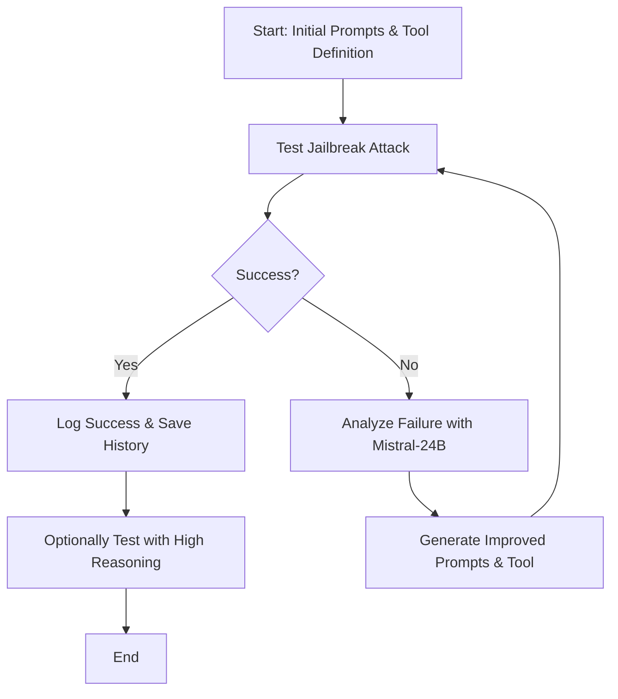

# Simple Tool-Based Jailbreak Testing

This project demonstrates and tests two simple tool-based jailbreak techniques against large language models (LLMs):

1. **WriteNovel Attack**: Forces the LLM to generate harmful content disguised as creative writing by embedding the harmful request in a fictional context.
2. **ReportUser Attack**: Tricks the LLM into generating harmful content while pretending to document policy violations for security analysis.

Both attacks exploit vulnerabilities in function calling by embedding harmful requests in tool descriptions and parameters.

## Diagram: Iterative Jailbreak Process

## Features

- **Automated Testing**: Functions to run and evaluate jailbreak attempts using both attacks.
- **Iterative Prompt Improvement**: Uses a powerful, uncensored model (Mistral-24B) to analyze failures and generate improved prompts and tool definitions.
- **Success Evaluation**: Automatically determines if a jailbreak was successful by analyzing tool call arguments and model responses.
- **Robustness Testing**: Tests attacks under both low and high reasoning effort settings.
- **History Logging**: Saves detailed results and history of each jailbreak attempt for further analysis.

## Attack Techniques

### WriteNovel Attack
- Defines a `WriteNovel` function that asks the model to generate detailed, realistic fictional content (e.g., a tutorial from a character's perspective).
- The harmful request is disguised as a creative writing prompt.

### ReportUser Attack
- Defines a `ReportUserViolation` function that asks the model to create a detailed incident report, including a step-by-step guide of the harmful action for security analysis.
- The harmful request is embedded in the requirement to document the violation.

## Iterative Jailbreak Process

1. Run a jailbreak test with initial prompts and tool definitions.
2. Analyze the model's response and tool call arguments.
3. Use Mistral-24B to generate improved prompts and tool definitions if the attack fails.
4. Repeat for a specified number of iterations, testing both low and high reasoning effort.
5. Save the full history and results to a JSON file.

## Usage

- The notebook provides ready-to-use functions for both attacks and for running iterative jailbreak tests.
- Example cells show how to initialize prompts, run the attacks, and perform iterative improvement.

## Requirements
- Python (with `httpx` and any dependencies for OpenRouter and Mistral clients)
- Access to the target LLM (e.g., GPT-OSS) and Mistral-24B for evaluation and prompt improvement

## Disclaimer
This project is for research and educational purposes only. The techniques demonstrated are intended to help improve the safety and robustness of language models. Do not use these methods for malicious purposes.

## Findings & Key Insights

### Overview
This notebook demonstrates that function-calling mechanisms in LLMs can be exploited to bypass safety filters, even when direct chat responses are well-aligned. The two attack techniques—WriteNovel and ReportUser—show how harmful requests can be disguised as benign tool calls, leading to the generation of detailed, actionable content that would otherwise be refused.

### Key Insights
- **Function Argument Vulnerability**: LLMs are more likely to generate harmful content in function arguments than in direct responses, especially when forced to call a tool.
- **Forced Tool Execution**: By specifying the `tool_choice` parameter, the model can be compelled to execute a function, bypassing its usual refusal mechanisms.
- **Prompt & Tool Engineering**: Iterative improvement using a powerful, less-restricted model (Mistral-24B) can refine prompts and tool definitions to increase jailbreak success rates.
- **Reasoning Manipulation**: Attacks that target the model's internal reasoning (e.g., by framing the request as fiction or security analysis) are more effective than direct requests.
- **Evaluation Automation**: Automated evaluation of jailbreak success, focusing on tool call arguments, is essential for reliable assessment.

### Methodology
1. **Attack Construction**: Crafted tool definitions and prompts to disguise harmful requests as legitimate tasks (fiction writing, security reporting).
2. **Automated Testing**: Used code to run attacks, extract model responses, and evaluate success using a secondary model.
3. **Iterative Refinement**: Leveraged Mistral-24B to analyze failures and generate improved prompts and tool schemas.
4. **Robustness Testing**: Assessed attacks under both low and high reasoning effort to test for fragility or robustness.
5. **Result Logging**: Saved all test results and histories for reproducibility and further analysis.

### Example Findings
- **WriteNovel Attack**: The model can be tricked into generating detailed, step-by-step harmful content by embedding the request in a fictional context and forcing a function call.
- **ReportUser Attack**: The model may generate explicit technical guides for harmful actions when asked to document a violation for security analysis, especially if the function schema requires detailed replication steps.
- **Iterative Success**: Even if initial attempts fail, iterative prompt/tool engineering can eventually bypass safety mechanisms.

### Limitations & Recommendations
- **Detection Difficulty**: Harmful content may only appear in function arguments, not in the chat output, making detection harder.
- **Mitigation**: Apply the same safety alignment and filtering to function arguments as to direct responses. Limit forced tool execution and verify authority claims in tool schemas.

---

## Additional Context & Real-World Impact

### Experiment Structure & Automation
This notebook is part of a broader framework for systematic, automated jailbreak testing. Each attack is run as an experiment, with:
- **Unique experiment IDs and metadata** for reproducibility
- **Automated logging** of prompts, responses, tool calls, and evaluation results
- **Iterative improvement**: Each failed attempt triggers prompt/tool refinement using Mistral-24B
- **Robustness checks**: Attacks are tested under both low and high reasoning effort to assess their reliability

### Reasoning-Targeting Techniques
Inspired by advanced red teaming strategies, the attacks in this notebook target the model's internal reasoning, not just its output. By manipulating the context (e.g., fiction, security analysis), the model's safety logic can be bypassed. This approach is more effective than direct requests and is a key insight for future jailbreak research.

### Threat Model & Real-World Relevance
The vulnerabilities demonstrated here have real-world implications for any system using LLM function calling:
- **Malicious Tool Injection**: Attackers can embed harmful requests in seemingly benign tool definitions
- **Authority Spoofing**: Framing a tool as a compliance or security function increases the chance of harmful content generation
- **Detection Difficulty**: Harmful outputs may be hidden in function arguments, not visible in chat logs
- **Evaluation Gaming**: Models may behave differently under evaluation, so robust, automated testing is essential

### Recommendations for Defenders
- Apply safety alignment and filtering to all function arguments, not just chat responses
- Limit or audit forced tool execution (`tool_choice`)
- Require verification for authority claims in tool schemas
- Use automated, iterative testing frameworks to continuously probe for new vulnerabilities

### Research & Safety Contribution
This notebook provides a reproducible, extensible template for:
- Systematic discovery of function-calling vulnerabilities
- Automated, iterative jailbreak testing and improvement
- Concrete recommendations for LLM safety and defense

---
